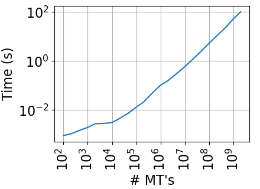
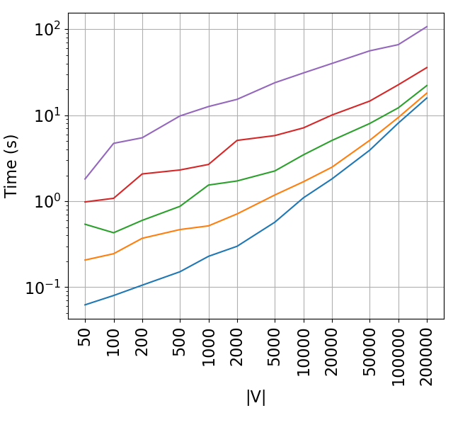
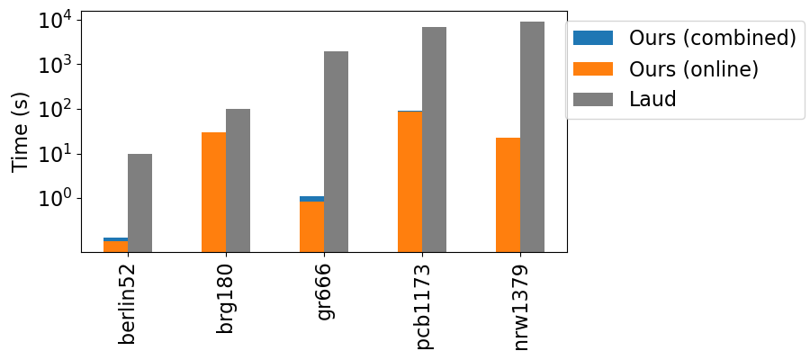
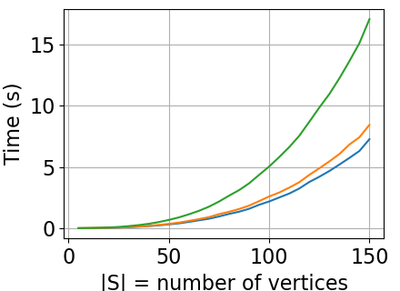
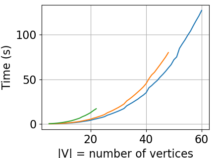

# Artifact Appendix

Paper title: **Private Shared Random Minimum Spanning Forests**

Artifacts HotCRP Id: **#25**

Requested Badge: **Reproduced**

## Description
This repository contains the entire source code for the experiments from the above-mentioned paper.

### Security/Privacy Issues and Ethical Concerns
None

## Basic Requirements
You will need *two* machines in order to test this two-party protocol properly.
In our paper, we distinguish between two different settings: The *LAN* setting, where the two servers have a very low round-trip time, and the *WAN* setting, where the two servers have 60ms of round-trip time.

Note that it is also possible to use a single machine in order to run both parties. However, note that you will require twice the amount of memory and cores of what is indicated below, and that this may not reflect real-world conditions well.

### Hardware Requirements
Each machine should have 8 cores, and 16 GiB memory. This should be sufficient for all experiments.
Only very small amounts of disk space (a couple of gigabytes) is required.

### Software Requirements
Only tested on Linux. The requirements are the same as for the ABY framework (see [here](README_ABY.md#requirements), they can all be installed via `apt-get` on Ubuntu).
In addition, an installation of Python 3 (at least 3.10) is required, with the matplotlib package (which can be installed e.g. `sudo apt-get install python3-matplotlib`).

### Estimated Time and Storage Consumption
See the experiment section for individual numbers. In total, expect less than 5 hours for the LAN setting, but mutliply this by ~10 if testing the WAN setting.

## Environment
Use Tag [v0.1](https://github.com/MarianDietz/secure-msf/releases/tag/v0.1) for a consistent state of this repository to use for artifact evaluation.

### Accessibility
Describe how to access your artifact via persistent sources.
Valid hosting options are institutional and third-party digital repositories.
Do not use personal web pages.
For repositories that evolve over time (e.g., Git Repositories ), specify a specific commit-id or tag to be evaluated.
In case your repository changes during the evaluation to address the reviewer's feedback, please provide an updated link (or commit-id / tag) in a comment.

### Set up the environment
First, on all machines, build ABY (including our new MSF functionality) after cloning the repository as follows:
```bash
mkdir build && cd build
cmake .. -DABY_BUILD_EXE=On
make
```

Second, generate all input files by running the following on both installations (or just once if using the same installation to run both parties):

```bash
python3 gen_inputs.py 
```
This may take a couple of minutes.

Below, please note the following for all runs: When starting one of the two parties in the command-line, you will need two things: the party's index, and the server's ip address.
One of the two parties needs to be the server (this one will have index 0), and the other party needs to be the client (this one will have index 1).
When asked for the ip address on the server instance, simply use `127.0.0.1` on the server's side. When asked for the ip adddress on the client instance, you need to enter the ip address of the server (e.g. `127.0.0.1` if both are running on the same instance, or some public IPv4 address when running across the internet).

**Our implementation always uses port 7766, so you need to ensure that this port is indeed open on the machine that plays the server's role.**

### Testing the Environment
Test whether everything works by generating a small number (100) of Multiplication Triples (mt's). To do so, run the following code on the server:
```bash
python3 run_msf.py 0 127.0.0.1 mt 100
```
After starting the command above, run the following code on the client:
```bash
python3 run_msf.py 1 [server's ip] mt 100
```

After doing both of these, you should receive the following outputs:
```bash
=== Running 100 MTs ===
Decreasing nthreads from 8 to 1 to fit window size
Decreasing nthreads from 8 to 1 to fit window size
writing 13 to file pre_comp_server.dump
```
and
```bash
=== Running 100 MTs ===
Decreasing nthreads from 8 to 1 to fit window size
Decreasing nthreads from 8 to 1 to fit window size
writing 13 to file pre_comp_client.dump
```

## Artifact Evaluation
We now briefly how the paper's main results can be reproduced using this repository.

### Main Results and Claims

In our paper, we demonstrate that our protocol outperforms the baseline for many inputs.
To this extent, our evaluation essentially just runs the protocol on many different inputs of different sizes and parameters. These results can then be visualized once enough runs have been executed.
For example, in our paper we show that on a graph with 200'000 vertices, our protocol may take between 20 and 100 seconds in a LAN setting, depending on the edge weight distribution.

### Experiments 

All experiments should be run once in a LAN setting, and once in a WAN setting, as the results will be very different (up to a factor of approximately 10).
*Ensure to create a copy of the `stats` folder after running the experiments in either of the two settings, because otherwise all the files will be overwritten by the new experiments.*

To run the LAN setting, ensure that you have two machines in the same local network, and that the environment works on both of them. (Alternatively, you can also use a single machine for running both of the parties. However, note that this does not represent the real-world well and may be slightly faster than the numbers presented in the paper.)
To run the WAN setting, use two machines where the round-trip time is approximately 60ms (in our evaluation, the bandwidth was 390Mbps).

#### Experiment 0: Generating Multiplication Triples
Before running any of the other experiments, it is important to precompute sufficiently many MT's. This will significantly speed up the remaining experiments (and in our paper we always assume that enough MT's are available).
Note that the same MT's will be re-used for all experiments. Of course this is insecure, but allows us to run a large number of experiments without the need of regenerating all MT's repeatedly.

The first, (somewhat) quick option for this is to just generate 4 billion MT's in the following way: Run
```bash
python3 run_msf.py 0 127.0.0.1 mt 4000000000
```
on the server, and then
```bash
python3 run_msf.py 1 [server's ip] mt 4000000000
```
on the client.
This is going to take several minutes in the LAN setting. In the WAN setting, it may take up to an hour. However, if all you want to do is to run the remaining experiments in the WAN setting, then you can also just run the above in the LAN setting, and then copy the two created files `pre_comp_client.dump` and `pre_comp_server.dump` to the two WAN machines.

However, in order to benchmark the generation of MT's for varying numbers, you can run the above commands with `all` instead of `4000000000`.
Doing so later allows creating a plot as in Figure 3 of our paper, which shows the amount of time taken in dependency of the number of MT's to be generated.

For each experiment run by the commands above, in the `stats` folder, the server (the same happens for the client, but the result will be almost identical) will create a file `genmt-n-p0.txt` (where `n` is the number of MT's generated), e.g.:
```
ots(total) 286182
ots(recv/send) 16000190953 16000190953
```
The first lines denotes the number of millseconds taken by that experiment, and the second line contains the number of bytes received/sent during the run.

**These experiments allow reproducing Figure 3 in our paper.** For example, in the LAN setting:



#### Experiment 1: MSF protocol
This is the main experiment, as it executes our full protocol. Before running this, ensure that experiment 0 has been done.

For our work, we evaluate the protocol for `N=10,20,50,100,200,500,1000,2000,5000,10000,20000,50000,100000,200000` vertices and `M=3*N` or `M=6*N`edges.
Furthermore, edge weights are either `unique` (i.e., the edge weight ordering is chosen uniformly at random), or `bounded` (i.e., each edge weight is selected independently, uniformly random at random between `0` and `W*M` for some fixed `W=1.0,0.5,0.2,0.1,0.05`).
For each of these combinations, we further run 3 instances (denoted by `T=1,2,3`).

All of these experiments can be easily run sequentially: On the server, execute 
```bash
python3 run_msf.py 0 127.0.0.1 msf all
```
and on the client, execute
```bash
python3 run_msf.py 1 [server's ip] msf all
```
You will be able to see progress in the command-line. In case it seems that there was an error and nothing is happening anymore, just abort and re-run the same commands. Experiments that were already completed will be skipped in the future.

For each experiment, in the `stats` folder, the server will create a file `unique-N-(M/N)-T-p0.txt` or `bounded-N-(M/N)-W-T-p0.txt`, e.g.:
```
iterations 141
phase1(total/aby/setup/network) 3029.63 528.488 80.517 308.463
phase1(recv/send) 13992937 14070837
phase2(total/aby/setup/network) 8312.75 4516.85 1133.79 710.099
phase2(recv/send) 346541447 346541453
ands(computew,connectivity,subgraph) 39823641 4656594 1379392296
subgraphs 2:181285 3:7483 4:943 5:101 6:13 7:1
```
This tells us the following information: Phase 1 of our protocol required 141 iterations, took 3029.63 milliseconds, and almost 14 MiB have been received from the other party.
Phase 2 took 8312.75 milliseconds, and more than 346 MiB have been received.
In total, the number of consumed MT's was 39823641 when securely comparing edge weights with each other, 4656594 when running the `Connectivity` sub-protocol, and 1379392296 when running the `IsolatedMSF` sub-protocol.
The latter was executed with 2 nodes in the input for 181285 times, with 3 nodes for 7483 times, with 4 nodes for 943 times, and so on.

**These experiments allow reproducing Figures 4, 5, and 7 in our paper.** For example, in the LAN setting, the amount of time spent for varying parameters `W` looks as follows:



##### TSP Graphs

We also evaluated our protocol for 5 predefined TSP graphs. These inputs are contained in `inputs/tsp`.
To run the experiments on them, run the following on the server:
```bash
python3 run_msf.py 0 127.0.0.1 msf tsp
```
And the following on the client:
```bash
python3 run_msf.py 1 [server's ip] msf tsp
```
This will create files `berlin52-1-p0.txt`, `brg180-1-p0.txt`, `gr666-1-p0.txt`, `nrw1379-1-p0.txt`, `pcb1173-1-p0.txt` in the `stats` folder.
These stats files have the same format as those generated for random graphs above.

**These experiments allow reproducing Figure 6 in our paper.** For example, in the LAN setting, the required amount of time (and compared with estimations of Laud's protocol) are as follows:



#### Experiment 2: Connectivity sub-protocol
Here, the Connectivity sub-protocol is benchmarked as a standalone protocol. Before running this, ensure that experiment 0 has been done.

For our work, we evaluate the protocol for inputs with `N=1,2,...,150` vertices, in a SIMD-fashion for 1, 10, 100, or 1000 times.

All of these experiments can be easily run sequentially: On the server, execute
```bash
python3 run_msf.py 0 127.0.0.1 connectivity all
```
and on the client, execute
```bash
python3 run_msf.py 1 [server's ip] connectivity all
```

For each experiment, in the `stats` folder, the server will create a file `connectivity-N-M-p0.txt`, e.g.:
```
connectivity(total) 1386.4
ands 11357850
connectivity(recv/send) 2862264 2862264
```
The first line shows the total running time in milliseconds, the second line the number of used MT's, and the third line the amount of bytes communicated.

**These experiments allow reproducing Figure 8 and 10 (left) in our paper.** For example, in the LAN setting, the required amount of time for varying input sizes are as follows:



#### Experiment 3: IsolatedMSF sub-protocol
Here, the IsolatedMSF sub-protocol is benchmarked as a standalone protocol. Before running this, ensure that experiment 0 has been done.

For our work, we evaluate the protocol for inputs with `N <= 60` vertices, in a SIMD-fashion for 1, 10, 100, or 1000 times (in the latter two cases, at most `N <= 48` or `N <= 22` are possible, as otherwise too many MT's would be required).

All of these experiments can be easily run sequentially: On the server, execute
```bash
python3 run_msf.py 0 127.0.0.1 subgraph all
```
and on the client, execute
```bash
python3 run_msf.py 1 [server's ip] subgraph all
```

For each experiment, in the `stats` folder, the server will create a file `subgraph-N-M-p0.txt`, e.g.:
```
subgraph(total) 30341.5
ands 22487298
subgraph(recv/send) 5679994 5682959
```
The first line shows the total running time in milliseconds, the second line the number of used MT's, and the third line the amount of bytes communicated.

**These experiments allow reproducing Figure 9 and 10 (right) in our paper.** For example, in the LAN setting, the required amount of time for varying input sizes are as follows:



### Plotting the results

After running all of the experiments above, the `stats` folder will contain a file starting with `genmt`, `bounded`, `unique`, `connectivity`, or `subgraph` for each individual experiment run.
In the `plots` directory, we provide a script that allows turning these raw numbers into plots.

By default, the `plots` directory contains the raw numbers generated when we ran the experiments for our paper.
If you would like to plot the numbers you received when running the experiments yourself, you need to copy the generated `stats` folder into `plots`, and rename it to either `stats_lan` or `stats_wan` (depending on whether the experiments were performed in a LAN or WAN environment).
After doing so, enter the `plots` directory and run
```bash
python3 plot.py
```
This will create all plots for which all required experiment data is available (the script will tell you if some plot failed due to a missing experiment).
For example, if you want to receive plots for both LAN and WAN settings, you need to run all experiments in both settings first, and ensure that both `stats_lan` and `stats_wan` are available in the `plots` directory.

*The script will, by default, use the stats files created by party 0 (the server). Therefore, ensure that you generate the plots on the server. Note that the plots of the client will be almost identical, but their stats have different filenames and therefore the script does not work with them.*

## Limitations
None
